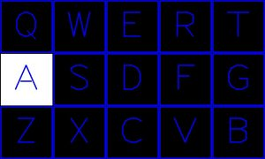

# Gaze-contolled-Keyboard
## Situation:
I came across a blog on how Computer Vision can help people affected by quadriplegia who have completely lost control of their limbs. 

The zeal to work in Computer Vision with OpenCV made me do some real-world projects that could be helpful for such people. In this project, the idea is to create an automatic virtual keyboard which can be controlled by our gaze without using the hands.

## Task:
The “gaze-controlled keyboard” is an application in which we are going to control the keyboard through our eyes. Here, Python with OpenCV will be used completely from scratch. The goal of such an app is to write without using our hands.

## Action/Approach
This project is built in two main parts:

* **Eye detection**: Detection of the eyes (with or without glasses), their movement and, most importantly, their blinking.

* **Virtual keyboard**: A keyboard on the screen where we’re going to select the letters by just using/blinking our eyes.

### 1.1 Eye detection
Here, real-time video detection from the webcam will be applied to detect the frames. To detect the eyes, we will use the face landmark detection approach. We will be able to find 68 specific landmarks of the face using the dlib library. To each point, there is a specific index assigned. Hence, we will use the following landmark points to detect the eye.

* Left eye points: (36, 37, 38, 39, 40, 41)

* Right eye points: (42, 43, 44, 45, 46, 47)

### 1.2 Detecting the blinking
After we detect the eye. we detect the 2 lines: a horizontal line and a vertical line crossing the eye.

Visual of eye when it is open.

Visual of eye when it is closed.

ratio = hor_line_lenght / ver_line_lenght
By calculating the ratio of the length of the horizontal line to the vertical line. We observed that if the ratio is more than 6.0, the eyes are closed. Hence after improving this parameter to near 5.5-5.7 gives more accuracy of blinking the eye.

### 1.3 Gaze Detection
The idea is to divide the keyboard into two parts. The part of the keyboard either left or right focused by eye gets activated and lights up.

Here is how the virtual keyboard is divided

Hence, for that, we need to detect the gaze of our eyes. The possible directions of gaze are shown in the image below.

The idea is to split the eye in two parts and to find out in which of the two parts there is more sclera (white part of eye) visible.

If the sclera is more visible on the right part, the eye is looking to the left (our left) like in the picture attached above. Moreover, to detect the sclera, we convert the eye into grayscale, then find a **threshold** that helps us to count the white pixels.

We divide the white pixels of the left part and those of the right part to achieve the gaze ratio. 

* If the gaze ratio < 1: looking to the right. 

* If the gaze ratio > 1.7, the eyes are looking to the left side.

### 2.1 Virtual Keyboard
The idea is to choose the left or right keyboard that we have already divided and display the keys on the screen. Light up the keys one at a time according to the pace of your blinking. The key you want to choose should be lighted up, and then blink your eyes for longer than 1 second. This will allow the letter to be typed on a whiteboard along with a beep sound.

Using mathematical logic in NumPy and cv2 libraries, we create the keyboard.

This is a left-side keyboard.

### 2.2 Light up letters each 10 frames
Letters will light up after every 10 frames to reach the letter we want to press. Blinking eye for longer will type the key.

## Final result

I have tried typing the word TURN LEFT NOW

#### Inspiration From
Pyscource blogs by Sergio Canu

#### Author

Ujjawal Mittal (ujjawal0902)
